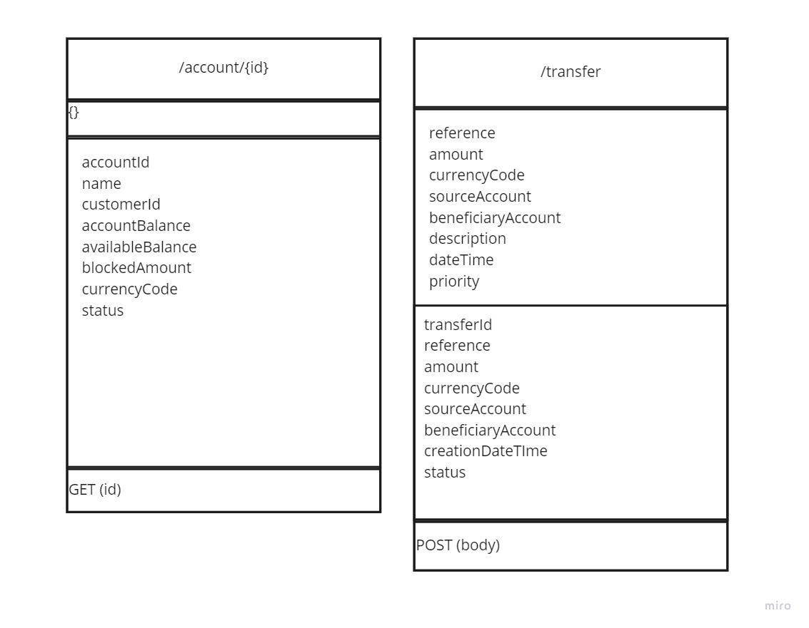

<table>
  <tr>
    <td><a href="overview.md">Previous</a></td>
    <td><a href="../README.md">Home</a></td>
  </tr>
</table>

## APIs definition

Transfer service exposes 2 endpoints:
- initiate transfer API to transfer money between 2 accounts already registered in the system, having the same currency code
- get account balance to retrieve the account details for a given account id

Transfer Service APIs are described in the following image:

