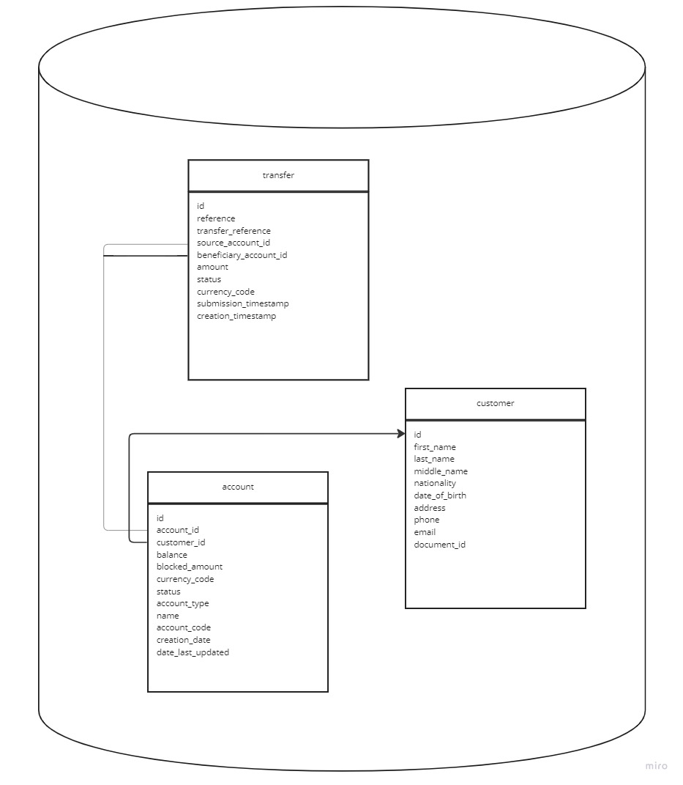

<table>
  <tr>
    <td><a href="../README.md">Home</a></td>
    <td><a href="apis.md">Next</a></td>
  </tr>
</table>

## Overview

Handles account to account transactions, for the same currency code accounts.
Currency code is not validated at this point.

### Database structure
The following database structure is created when application is starting:



An H2 database is used, and it is created using liquibase based on the changelog defined in transaction-database module.

### Application setup
Application starts on port _8089_, based on the following property defined in application.properties file:
```
server.port=8089
```

### Testing
Application was tested using unit and integration tests.
To cover the testing for concurrent transactions, the application was tested with integration tests, which send in parallel multiple requests to the application.
